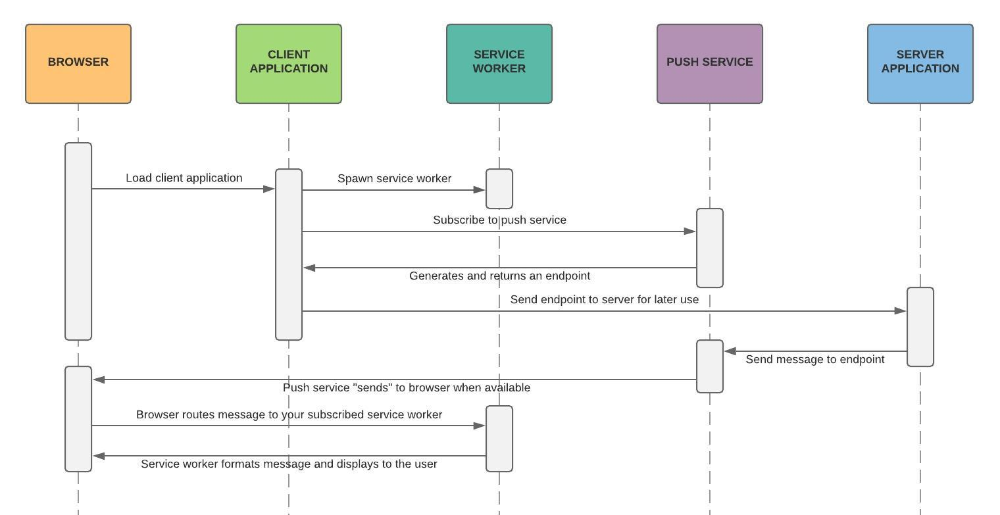

# Browser-based Notification Strategies

- [Web Push Notifications](#web-push-notifications)
  - [Are push services free?](#are-push-services-free)
  - [Application Server Keys and the VAPID Spec](#application-server-keys-and-the-vapid-spec)
  - [Implementing Web Push Notifications](#implementing-web-push-notifications)
- [In-app Messaging](#in-app-messaging)
  - [WebSockets](#websockets)
  - [Server Sent Events](#server-sent-events)
  - [Long Polling](#long-polling)
- [Related Technologies and Other Solutions](#related-technologies-and-other-solutions)
- [Additional Thoughts](#additional-thoughts)

## Web Push Notifications

Native web push notifications are accomplished by two separate browser APIs working in tandem, the [Push API](https://developer.mozilla.org/en-US/docs/Web/API/Push_API), and the [Notifications API](https://developer.mozilla.org/en-US/docs/Web/API/Notifications_API).<sup>[[1]](#footnote-1)</sup> These work together because notifications are supported both in the browser as well as within web workers and service workers. The Push API *must* be used within a service worker. Essentially, your web application registers a worker that listens for push events. The service worker can remain running even after the web page has been closed, so as messages are received, the worker can use the Notifications API to create a message for the browser window.

Once the user approves push notifications, the browser generates a unique push service endpoint. Browsers dictate which push service is used, however all major push services conform to the same [HTTP Web Push](https://tools.ietf.org/html/draft-ietf-webpush-protocol-12) protocol. This endpoint can be sent back to the server and stored to make asynchronous pushes back to the browser.

When the server is ready to notify the browser, it can push messages to the push endpoint, which passes it through to the browser. The mechanisms for which the push service informs the browser (or how the browser makes a new connection when it comes online) are not clear from what I have found, but I imagine most implementations use an HTTP/2 connection, WebSockets, or some sort of XMPP/RTC protocol<sup>[[2]](#footnote-2)</sup>.

> Note: If the user's device is not online, push services queue up messages until they do, or until a defined TTL is expired.

All-in-all, the process looks something like this:<sup>[[3]](#footnote-3)</sup>

1. Client application requests a push service endpoint in a service worker
2. Client takes that endpoint and sends it to the server application
3. Server application stores that endpoint with user data
4. *Time passes...*
5. Server application fetches the user's endpoint
6. Server application makes a request to the push service endpoint
7. *Browser manages connection with push service...*
8. Push service sends message to the browser
9. Browser routes the message to the correct service worker for your application
10. Service worker receives the message and formats it for the Notifications API
11. Browser displays notification



One quirk about push notifications is that they can be deduplicated or replaced at the *topic* level, meaning that any new push notifications for the same topic will be overwritten if they have not yet been delivered.<sup>[[4]](#footnote-4)</sup>

### Are push services free?

Most browsers now use push services internally (Chrome uses Firebase's FCM, Mozilla uses [autopush](https://github.com/mozilla-services/autopush)). There are plenty of third-party push notification services as well, some are free.

### Application Server Keys and the VAPID Spec

It's a best practice to secure push notifications in transit by using an application server keypair to encrypt messages and verify messages are being sent by a known application server. The Web Push protocol conforms to the [VAPID spec](https://tools.ietf.org/id/draft-ietf-webpush-vapid-03.html). There are a few methods for generating an application server keypair, but this seems to be easy enough:

```sh
npm install -g web-push
web-push generate-vapid-keys
```

### Implementing Web Push Notifications

In order to generate a push endpoint for your user's device, in a client script file, you may see something like the following code, where a application public key is used to request a push subscription from a registered service worker.

```js
/* In client.js */

const PUBLIC_KEY = 'BNTRUNdN2VRJzWIn50MEp77oVYVrJpdB_ICXFXDSVc7rkT0I0gJKSzor9WBlQYsmX9N2wYdYgDXJAKN7lJ10pb0';

async function createPushSubscription() {
  // Confirm browser support.
  if (!('serviceWorker' in navigator && 'PushManager' in window)) {
    throw new Error('Push notifications are not supported by the browser');
  }

  // Request notification permission from the user.
  const permissionResult = await Notification.requestPermission();
  if (permissionResult !== 'granted') {
    throw new Error('Push notifications are not allowed by the user');
  }

  // Register your service worker and subscribe to push notifications.
  const registration = await navigator.serviceWorker.register('/service-worker.js');
  const pushSubscription = await registration.pushManager.subscribe({
    userVisibleOnly: true,
    applicationServerKey: urlBase64ToUint8Array(PUBLIC_KEY),
  });

  return pushSubscription;
}
```

The call to `navigator.serviceWorker.register()` accepts a path to a script file, which will handle incoming push notifications even if the client application is not loaded. The service worker should listen for a `push` event, and use the data in that event to create a new notification. The service worker can fetch additional information from an API or track analytics.

```js
/* In service-worker.js */

self.addEventListener('push', (event) => {
  // Do analytics, fetch more information from the server, etc...
  const { title, body } = event.data.json();
  const promiseChain = self.registration.showNotification(title, { body });

  // If you're doing a lot of asynchronous things and don't wait until it completes
  // the browser may stop the service worker at any time.
  event.waitUntil(promiseChain);
});
```

The function `createPushSubscription()` returns a subscription payload containing the service endpoint you would send data to, as well as some authorization keys to verify the request. The client application should send the entire payload off to your server to persist. At a later time, you may use this payload in a server-side web push library like Python's [pywebpush](https://pypi.org/project/pywebpush/) or Node.js's [web-push](https://www.npmjs.com/package/web-push). An example payload is shown below:

```json
{
  "endpoint": "https://fcm.googleapis.com/fcm/send/c9jszw3buWY:APA91bHvtsl6X5z2tTxdxjN19XJYZjTpBbatjq1gyiQvPlTpeyufXSyVGcZezn_AbvjCDnEkaJ3CapRaExUHJaeS_QgIeULpzhINB6_LIwD5Ev_cgJuvn76R1fSi2dLcTMmMbD_0uBZL",
  "expirationTime": null,
  "keys": {
    "p256dh": "BExTQruFJPje205zIEI-GpEn-xZxcRUuQ-idC2B2pElh9nftoKLEkY6lMxQJPv-xU1VOWyvM1X2idfzrDl5Qxdk",
    "auth": "ipQmd0j_imNv1TqzHDBQWQ"
  }
}
```

## In-app Messaging

Unlike push notifications, in-app messaging could be accomplished any number of ways, however the most common implementations seem to be either a polling/pulling method by hitting a server periodically to request any new messages, or a push method using WebSockets or SSE. Deciding factors for this may include limitations of the number of concurrent long running connections, how often messages are expected to be received, or whether your client sessions need to be sticky (hit the same server for each request).

### WebSockets

WebSockets for example are able to transmit hundreds to thousands<sup>[[5]](#footnote-5)</sup> of messages per second for a client, however, there is an upper bound on the number of clients that can connect to a single server. If you're only expecting a single message every few hours to a handful of clients, persistent WebSocket connections may be overkill, in which case you may look to long-polling as an alternative, or only initialize a new connection when you know the client will be expecting messages. WebSockets are also bidirectional, which adds a layer of unnecessary complexity if your application's messaging doesn't require client-to-server communication.

> A common strategy for scaling WebSockets is to have a pubsub broker. Because you cannot ensure that the client you're looking for is connected to a given server, a pubsub can broadcast to all socket servers, and each server searches its connected clients to find the recipient.<sup>[[6]](#footnote-6)</sup>

### Server Sent Events

Compared to WebSockets, Server Sent Events (SSE) is an older but somewhat simpler solution of using an open connection to continually push updates unidirectionally from the browser to the client. Most browsers support the [EventSource](https://developer.mozilla.org/en-US/docs/Web/API/EventSource) API, which simply opens a persistent HTTP connection that consumes a `text/event-stream` formatted stream.

### Long Polling

Long polling's primary benefit is that it leverages simple HTTP request mechanisms, so it's much easier to integrate into client applications that already communicate with servers. At least from a cost perspective, it suits use cases where low volumes of messages are transmitted infrequently.

## Related Technologies and Other Solutions

- [AMPQ via WebSockets](https://alexfranchuk.com/blog/amqp-using-websockets/)
- [MQTT via WebSockets](https://github.com/mqttjs/MQTT.js/)
- [WebRTC/RTCDataChannel](https://developer.mozilla.org/en-US/docs/Web/API/RTCDataChannel)
- [Service workers](https://developers.google.com/web/fundamentals/primers/service-workers) (Background scripts that run separate from a web page.)
- [Background Sync](https://developers.google.com/web/updates/2015/12/background-sync#what_could_i_use_background_sync_for) (Could be interesting for completing requests even as the user is moving to a different page.)
- [CacheStorage](https://developer.mozilla.org/en-US/docs/Web/API/CacheStorage)

## Additional Thoughts

- The popup to request browser notifications (push or otherwise) is easily ignorable. It's important not to request this on first page load, but rather somewhere in a user's preferences or where it's easy to contextualize *why* they will be receiving alerts.

---

<sup id="footnote-1">1</sup> Web Push Notifications: Timely, Relevant, and Precise, [Google](https://developers.google.com/web/fundamentals/push-notifications)
<br />
<sup id="footnote-2">2</sup> Push Technology, [Wikipedia](https://en.wikipedia.org/wiki/Push_technology#Examples)
<br />
<sup id="footnote-3">3</sup> How Push Works, [Google](https://developers.google.com/web/fundamentals/push-notifications/how-push-works)
<br />
<sup id="footnote-4">4</sup> [IETF HTTP Web Push Protocol, Section 5.4](https://tools.ietf.org/html/draft-ietf-webpush-protocol-12#section-5.4)
<br />
<sup id="footnote-5">5</sup> [How many messages per second can WebSocket send and receive?](https://medium.com/@syncagio/how-many-messages-per-second-can-websocket-send-and-receive-2c70f2d000c1)
<br />
<sup id="footnote-6">6</sup> [Scaling WebSockets](https://hackernoon.com/scaling-websockets-9a31497af051)
